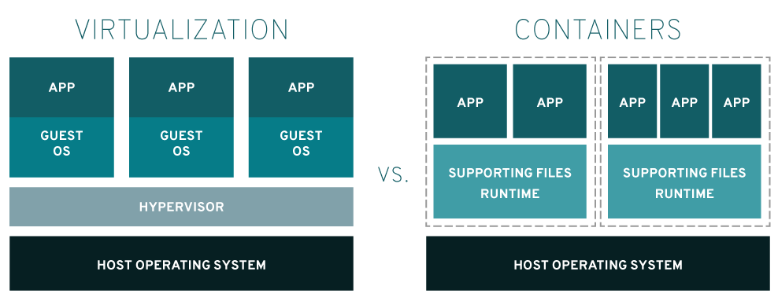

# 도커 (Docker)

 

## docker ?

도커란 컨테이너를 이용하여 어플리케이션을 실행, 개발, deploy를 수행하는 플랫폼이다.  

도커는 컨테이너형 가상화 기술(운영 체제 수준 가상화)을 사용  

컨테이너형 가상화를 사용하면 **가상화 소프트웨어 없이도 운영 체제의 리소스를 격리** 하여 가상 운영 체제로 만들 수 있다.  

 

### 호스트 운영체제 형 가상화 VS 컨테이너형 가상화

호스트 운영체제형 가상화는 구조적으로 오버헤드가 크다.  

컨테이너형 가상화는 운영 체제 대부분을 호스트 운영 체제와 공유한다. 실행에 걸리는 시간이 적은 만큼 구성을 수정하지 않고 인프라를 완전히 새로 만드는 불변 인프라와 궁합이 잘 맞는다.  

 

### image ?

image 란 어플리케이션을 실행시키기 위한 라이브러리, 환경설정 등을 포함한 실행가능한 패키지이다.

컨테이너란 이미지의 instance이다.

 

 

|옵션|설명|
|:--: |:-- |
| -d  |detached mode (백그라운드 모드)   |
|-p   |Host와 컨테이너의 Port를 연결 (fowarding)   |
|  -v | Host와 컨테이너의 Directory 연결 (마운트)  |
|-e   | 컨테이너 내에서 사용할 환경변수 설정  |
|-it   | -i와 -t를 동시에 사용한 것으로 터미널 입력을 위한 옵션  |
|--rm   | 프로세스 종료시 컨테이너 자동 제거  |
|--link   |  컨테이너 연결[컨테이너명:별칭] |
|--name   | 컨테이너 이름 설정  |

 

### 참고자료

- https://www.redhat.com/ko/topics/containers/whats-a-linux-container  

- https://www.44bits.io/ko/post/why-should-i-use-docker-container  