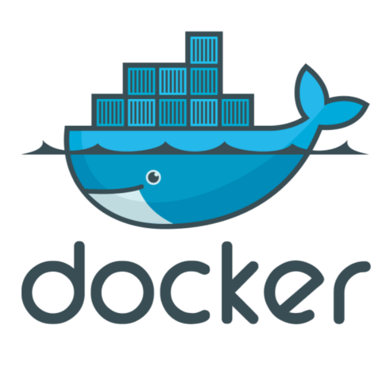
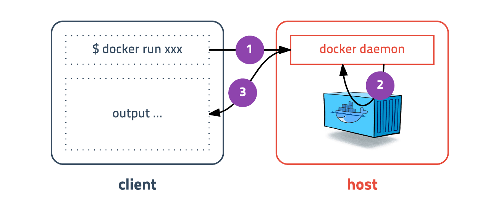

# 도커 (Docker)



**Client / Server**




<br/>

**도커 명령어**

```
docker run [OPTIONS] IMAGE[:TAG|@DIGEST] [COMMAND] [ARG...]
```

<br/>

|옵션|설명|
|:--: |:-- |
| -d  |detached mode (백그라운드 모드)   |
|-p   |Host와 컨테이너의 Port를 연결 (fowarding)   |
|  -v | Host와 컨테이너의 Directory 연결 (마운트)  |
|-e   | 컨테이너 내에서 사용할 환경변수 설정  |
|-it   | -i와 -t를 동시에 사용한 것으로 터미널 입력을 위한 옵션  |
|--rm   | 프로세스 종료시 컨테이너 자동 제거  |
|--link   |  컨테이너 연결[컨테이너명:별칭] |
|--name   | 컨테이너 이름 설정  |

<BR/>
