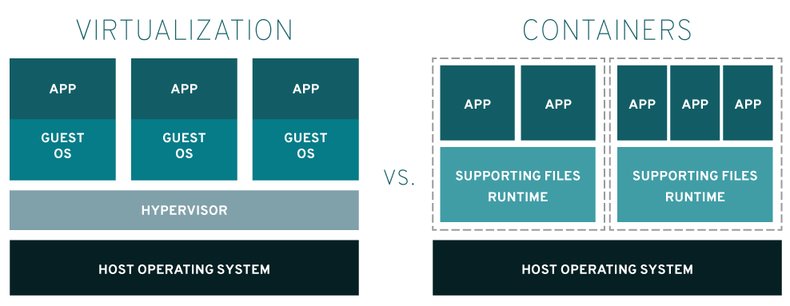

# 도커 (Docker)

 

## docker ?

도커란 컨테이너를 이용하여 어플리케이션을 실행, 개발, deploy를 수행하는 플랫폼이다.

 

### image ?

image 란 어플리케이션을 실행시키기 위한 라이브러리, 환경설정 등을 포함한 실행가능한 패키지이다.

컨테이너란 이미지의 instance이다.

 

 

 

|옵션|설명|
|:--: |:-- |
| -d  |detached mode (백그라운드 모드)   |
|-p   |Host와 컨테이너의 Port를 연결 (fowarding)   |
|  -v | Host와 컨테이너의 Directory 연결 (마운트)  |
|-e   | 컨테이너 내에서 사용할 환경변수 설정  |
|-it   | -i와 -t를 동시에 사용한 것으로 터미널 입력을 위한 옵션  |
|--rm   | 프로세스 종료시 컨테이너 자동 제거  |
|--link   |  컨테이너 연결[컨테이너명:별칭] |
|--name   | 컨테이너 이름 설정  |

 

### 참고자료

https://www.redhat.com/ko/topics/containers/whats-a-linux-container
