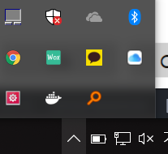

#도커 설치

> 도커 종류 2개가 있다.
> `Toolbox` 와 `Docker-for-windows(+hyper-v)`
> Docker-for-windows는 윈도우10만 지원하기때문에
> 하위버전은 Docker Toolbox를 써야한다(??)
> 학교 윈7 32bit인데 Toolbox도 안되설치 던데


1 . [Docker-for-windows 홈페이지에서 설치](https://docs.docker.com/docker-for-windows/install/) 할수도 있지만, chocolatey로 설치할래~~

<BR/>
<BR/>

### 1. chocolatey 설치하기

<BR/>

**관리자모드로 cmd 실행**


<BR/>

**chocolatey 설치**

```
@"%SystemRoot%\System32\WindowsPowerShell\v1.0\powershell.exe" -NoProfile -InputFormat None -ExecutionPolicy Bypass -Command "iex ((New-Object System.Net.WebClient).DownloadString('https://chocolatey.org/install.ps1'))" && SET "PATH=%PATH%;%ALLUSERSPROFILE%\chocolatey\bin"
```


<br/>

### 2. docker 다운로드

```
choco install docker-for-windows --ignore-checksums -y

```

<br/>

**환경변수 추가**

```
setx path=%path%;C:\Program Files\Docker\Docker\resources\bin
```

<br/>

**cmd 껐다 키자~**

<br/>

**docker 버전확인** **`docker version`**

```
C:\Users\bactoria>docker version
Client:
 Version:       18.03.0-ce
 API version:   1.37
 Go version:    go1.9.4
 Git commit:    0520e24
 Built: Wed Mar 21 23:06:28 2018
 OS/Arch:       windows/amd64
 Experimental:  false
 Orchestrator:  swarm

Server:
 Engine:
  Version:      18.03.0-ce
  API version:  1.37 (minimum version 1.12)
  Go version:   go1.9.4
  Git commit:   0520e24
  Built:        Wed Mar 21 23:14:32 2018
  OS/Arch:      linux/amd64
  Experimental: false

C:\Users\bactoria>
```

<br/>

**Docker for Windows.exe 실행하기**

위처럼 Server가 안나온다면

도커 켜져있는지 확인.



`Docker for Windows.exe` 실행하면 Hyper-V에 MobyLinuxVM이 만들어진다.

도커는 리눅스 컨테이너를 사용하는데

도커가 Hyper-V VM을 하나 만든다.

(좀더아라봥함)

<br/>

**Hyper-V 설정**


`Hyper-V` 가능하게 할거냐? 를 묻는데

원래 Docker가 리눅스 컨테이너로 동작하는데,

Windows에서도 지원하기 위해 Docker Host를 띄워야 한다.

Windows10 Pro 64bit, Windows10 Enterprise 64bit 에서는 `Hyper-V`를 이용하여 해결하는 것이다.

그 이전버전은 `Docker Toolbox`를 이용한다.

<br/>

**서버 동작 확인** **`docker version`**

```
C:\Users\bactoria>docker version
Client:
 Version:       17.12.0-ce
 API version:   1.35
 Go version:    go1.9.2
 Git commit:    c97c6d6
 Built: Wed Dec 27 20:05:22 2017
 OS/Arch:       windows/amd64

Server:
 Engine:
  Version:      17.12.0-ce
  API version:  1.35 (minimum version 1.12)
  Go version:   go1.9.2
  Git commit:   c97c6d6
  Built:        Wed Dec 27 20:12:29 2017
  OS/Arch:      linux/amd64
  Experimental: true
```

Client와 Server가 이렇게 뜨면 설치 잘 된거다.

사실 처음에는 아래처럼 서버에러가 떴는데.. 시간이 해결해줬다

```
C:\Users\bactoria>docker version
Client:
 Version:       17.12.0-ce
 API version:   1.35
 Go version:    go1.9.2
 Git commit:    c97c6d6
 Built: Wed Dec 27 20:05:22 2017
 OS/Arch:       windows/amd64
error during connect: Get http://%2F%2F.%2Fpipe%2Fdocker_engine/v1.35/version: open //./pipe/docker_engine: The system cannot find the file specified. In the default daemon configuration on Windows, the docker client must be run elevated to connect. This error may also indicate that the docker daemon is not running.
```

<BR/>

-끝-
