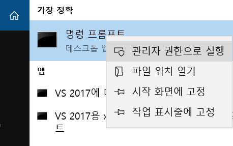

#도커 설치

1 . [홈페이지에서 설치](https://docs.docker.com/docker-for-windows/install/) 할수도 있지만, chocolatey로 설치할거
<BR/>
<BR/>

### **chocolatey로 도커 설치하기**

<BR/>

**관리자모드로 cmd 실행**



<BR/>

**chocolatey 설치** (cmd에 입력)
```
@"%SystemRoot%\System32\WindowsPowerShell\v1.0\powershell.exe" -NoProfile -InputFormat None -ExecutionPolicy Bypass -Command "iex ((New-Object System.Net.WebClient).DownloadString('https://chocolatey.org/install.ps1'))" && SET "PATH=%PATH%;%ALLUSERSPROFILE%\chocolatey\bin"
```


<br/>

**docker 다운로드**

```
choco install docker-for-windows --ignore-checksums
```

<br/>

**환경변수 추가**

```
setx path=%path%;C:\Program Files\Docker\Docker\resources\bin
```

<br/>

**cmd 껐다 키자~**

<br/>

**docker 버전확인** **`docker version`**

Server가 안뜬다면 Hyper-V를
.
<br/>

**Docker for Windows.exe 실행하기**

실행하면 Hyper-V에 MobyLinuxVM이 만들어진다.

도커는 리눅스 컨테이너를 사용하는데

도커가 Hyper-V VM을 하나 만든다.

(좀더아라봥함)

<br/>

**Hyper-V 설정**


`Hyper-V` 가능하게 할거냐를 묻는데

원래 Docker가 리눅스에서만 동작하는데,

Windows에서도 지원하기 위해 Docker Host를 띄워야 한다.

Windows10 Pro 64bit, Windows10 Enterprise 64bit 에서는 `Hyper-V`를 이용하여 해결하는 것이다.

그 이전버전은 `Docker Toolbox`를 이용한다.

<br/>

**도커 설치 확인**

```
C:\Users\bactoria>docker version
Client:
 Version:       17.12.0-ce
 API version:   1.35
 Go version:    go1.9.2
 Git commit:    c97c6d6
 Built: Wed Dec 27 20:05:22 2017
 OS/Arch:       windows/amd64

Server:
 Engine:
  Version:      17.12.0-ce
  API version:  1.35 (minimum version 1.12)
  Go version:   go1.9.2
  Git commit:   c97c6d6
  Built:        Wed Dec 27 20:12:29 2017
  OS/Arch:      linux/amd64
  Experimental: true
```

Client와 Server가 이렇게 뜨면 설치 잘 된거다.

사실 처음에는 아래와 같이 서버에러가 떴는데.. 시간이 해결해줬다

```
C:\Users\bactoria>docker version
Client:
 Version:       17.12.0-ce
 API version:   1.35
 Go version:    go1.9.2
 Git commit:    c97c6d6
 Built: Wed Dec 27 20:05:22 2017
 OS/Arch:       windows/amd64
error during connect: Get http://%2F%2F.%2Fpipe%2Fdocker_engine/v1.35/version: open //./pipe/docker_engine: The system cannot find the file specified. In the default daemon configuration on Windows, the docker client must be run elevated to connect. This error may also indicate that the docker daemon is not running.
```

<BR/>


### 가즈아~ 따라하즈아..

<br/>

**우분투 이미지 다운로드** **`docker pull ubuntu:16.04`**

```
C:\Users\bactoria>docker pull ubuntu:16.04
16.04: Pulling from library/ubuntu
22dc81ace0ea: Pull complete
1a8b3c87dba3: Pull complete
91390a1c435a: Pull complete
07844b14977e: Pull complete
b78396653dae: Pull complete
Digest: sha256:e348fbbea0e0a0e73ab0370de151e7800684445c509d46195aef73e090a49bd6
Status: Downloaded newer image for ubuntu:16.04

C:\Users\bactoria>
```
<BR/>

**이미지 확인하기** **`docker images`**

```
C:\Users\bactoria>docker images
REPOSITORY          TAG                 IMAGE ID            CREATED             SIZE
ubuntu              16.04               f975c5035748        2 weeks ago         112MB

C:\Users\bactoria>
```

<BR/>

**우분투 컨테이너 실행하기** **`docker run -it --name myUbuntu ubuntu:16.04 /bin/bash`**

```
C:\Users\bactoria>docker run -it --name myUbuntu ubuntu:16.04 /bin/bash
root@27db33196683:/#
```

<BR/>

**리눅스 접속 확인하기** **`ls`**

```
root@27db33196683:/# ls
bin  boot  dev  etc  home  lib  lib64  media  mnt  opt  proc  root  run  sbin  srv  sys  tmp  usr  var
root@27db33196683:/#
```

<BR/>

**우분투 컨테이너 종료하기** **`exit`**

```
root@27db33196683:/# exit
exit

C:\Users\bactoria>
```

<BR/>

**실행중인 컨테이너 확인하기** **`docker ps`**

```
C:\Users\bactoria>docker ps
CONTAINER ID        IMAGE               COMMAND             CREATED             STATUS              PORTS               NAMES

C:\Users\bactoria>
```

<BR/>

**모든 컨테이너 확인하기** **`docker ps -a`**

```
C:\Users\bactoria>docker ps -a
CONTAINER ID        IMAGE               COMMAND             CREATED             STATUS                      PORTS               NAMES
be76370e89aa        ubuntu:16.04        "/bin/bash"         45 seconds ago      Exited (0) 15 seconds ago                       myUbuntu

C:\Users\bactoria>
```

<BR/>

**종료된 컨테이너 재실행하기** **`docker start myUbuntu`**

```
C:\Users\bactoria>docker start myUbuntu
myUbuntu

C:\Users\bactoria>
```

<BR/>

**컨테이너 접속하기** **`docker attach myUbuntu` + `Enter X2`**

```
C:\Users\bactoria>docker attach myUbuntu
root@be76370e89aa:/#
root@be76370e89aa:/#
```

<BR/>

**컨테이너 빠져나가기** **`Ctrl+p` + `Ctrl+q`**  
(컨테이너 종료하지 않음)

```
root@be76370e89aa:/#
root@be76370e89aa:/# read escape sequence

C:\Users\bactoria>
```

<BR/>

**실행중인 컨테이너 확인하기** **`docker ps`**

```
C:\Users\bactoria>docker ps
CONTAINER ID        IMAGE               COMMAND             CREATED             STATUS              PORTS               NAMES
be76370e89aa        ubuntu:16.04        "/bin/bash"         5 minutes ago       Up 3 minutes                            myUbuntu

C:\Users\bactoria>
```

<BR/>

**컨테이너 종료하기** **`docker stop myUbuntu`**

```
C:\Users\bactoria>docker stop myUbuntu
myUbuntu

C:\Users\bactoria>
```

<BR/>


**이미지 삭제하기** **`docker rmi ubuntu:16.04`**  
(삭제안됨)


```

C:\Users\bactoria>docker rmi ubuntu:16.04
Error response from daemon: conflict: unable to remove repository reference "ubuntu:16.04" (must force) - container be76370e89aa is using its referenced image f975c5035748

C:\Users\bactoria>
```

<BR/>


**컨테이너 삭제하기** **`docker rm myUbuntu`**

```
C:\Users\bactoria>docker rm myUbuntu
myUbuntu

C:\Users\bactoria>
```

<BR/>

**컨테이너 삭제 확인** **`docker ps -a`**

```
C:\Users\bactoria>docker ps -a
CONTAINER ID        IMAGE               COMMAND             CREATED             STATUS              PORTS               NAMES

C:\Users\bactoria>
```

<BR/>

**로컬 이미지 보기** **`docker images`**

```
C:\Users\bactoria>docker images
REPOSITORY          TAG                 IMAGE ID            CREATED             SIZE
ubuntu              16.04               f975c5035748        2 weeks ago         112MB

C:\Users\bactoria>
```

<BR/>

**이미지 삭제하기** **`docker rmi ubuntu:16.04`**

```
C:\Users\bactoria>docker rmi ubuntu:16.04
Untagged: ubuntu:16.04
Untagged: ubuntu@sha256:e348fbbea0e0a0e73ab0370de151e7800684445c509d46195aef73e090a49bd6
Deleted: sha256:f975c50357489439eb9145dbfa16bb7cd06c02c31aa4df45c77de4d2baa4e232
Deleted: sha256:0bd983fc698ee9453dd7d21f8572ea1016ec9255346ceabb0f9e173b4348644f
Deleted: sha256:08fe90e1a1644431accc00cc80f519f4628dbf06a653c76800b116d3333d2b6d
Deleted: sha256:5dc5eef2b94edd185b4d39586e7beb385a54b6bac05d165c9d47494492448235
Deleted: sha256:14a40a140881d18382e13b37588b3aa70097bb4f3fb44085bc95663bdc68fe20
Deleted: sha256:a94e0d5a7c404d0e6fa15d8cd4010e69663bd8813b5117fbad71365a73656df9

C:\Users\bactoria>
```

<br/>
<br/>
<br/>


### Issues

* **컨테이너 attach 안될때**
restart 하고나서 다시 attach 붙이자.
( attach 명령 후 엔터 한번 더눌러 줘야함. )
