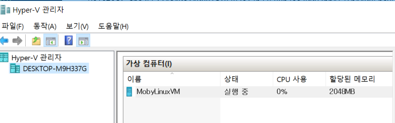

# 도커 명령어 익히기 ( + 우분투 설치 )

<br/>

**도커 명령어**

```
docker run [OPTIONS] IMAGE[:TAG|@DIGEST] [COMMAND] [ARG...]
```

<br/>

|옵션|설명|
|:--: |:-- |
| -d , --detach |detached mode (백그라운드 모드)   |
|-p  , --publish |Host와 컨테이너의 Port를 연결 (fowarding)   |
|  -v , --volume | Host와 컨테이너의 Directory 연결 (마운트)  |
|-e , --env  | 컨테이너 내에서 사용할 환경변수 설정  |
|-it   | -i와 -t를 동시에 사용한 것으로 터미널 입력을 위한 옵션  |
|--rm   | 프로세스 종료시 컨테이너 자동 제거  |
|--link   |  컨테이너 연결[컨테이너명:별칭] |
|--name   | 컨테이너 이름 설정  |

<BR/>

**도커 실행중인지 확인** **`docker version`**

```
C:\Users\bactoria>docker version
Client:
 Version:       18.03.0-ce
 API version:   1.37
 Go version:    go1.9.4
 Git commit:    0520e24
 Built: Wed Mar 21 23:06:28 2018
 OS/Arch:       windows/amd64
 Experimental:  false
 Orchestrator:  swarm

Server:
 Engine:
  Version:      18.03.0-ce
  API version:  1.37 (minimum version 1.12)
  Go version:   go1.9.4
  Git commit:   0520e24
  Built:        Wed Mar 21 23:14:32 2018
  OS/Arch:      linux/amd64
  Experimental: false

C:\Users\bactoria>
```

<BR/>


**우분투 이미지 다운로드** **`docker pull ubuntu:16.04`**

```
C:\Users\bactoria>docker pull ubuntu:16.04
16.04: Pulling from library/ubuntu
22dc81ace0ea: Pull complete
1a8b3c87dba3: Pull complete
91390a1c435a: Pull complete
07844b14977e: Pull complete
b78396653dae: Pull complete
Digest: sha256:e348fbbea0e0a0e73ab0370de151e7800684445c509d46195aef73e090a49bd6
Status: Downloaded newer image for ubuntu:16.04

C:\Users\bactoria>
```
<BR/>

**이미지 확인하기** **`docker images`**

```
C:\Users\bactoria>docker images
REPOSITORY          TAG                 IMAGE ID            CREATED             SIZE
ubuntu              16.04               f975c5035748        2 weeks ago         112MB

C:\Users\bactoria>
```

<BR/>

**우분투 컨테이너 실행하기** **`docker run -it --name myUbuntu ubuntu:16.04 /bin/bash`**

```
C:\Users\bactoria>docker run -it --name myUbuntu ubuntu:16.04 /bin/bash
root@27db33196683:/#
```

<BR/>

**리눅스 접속 확인하기** **`ls`**

```
root@27db33196683:/# ls
bin  boot  dev  etc  home  lib  lib64  media  mnt  opt  proc  root  run  sbin  srv  sys  tmp  usr  var
root@27db33196683:/#
```

<BR/>

**우분투 컨테이너 종료하기** **`exit`**

```
root@27db33196683:/# exit
exit

C:\Users\bactoria>
```

<BR/>

**실행중인 컨테이너 확인하기** **`docker ps`**

```
C:\Users\bactoria>docker ps
CONTAINER ID        IMAGE               COMMAND             CREATED             STATUS              PORTS               NAMES

C:\Users\bactoria>
```

<BR/>

**모든 컨테이너 확인하기** **`docker ps -a`**

```
C:\Users\bactoria>docker ps -a
CONTAINER ID        IMAGE               COMMAND             CREATED             STATUS                      PORTS               NAMES
be76370e89aa        ubuntu:16.04        "/bin/bash"         45 seconds ago      Exited (0) 15 seconds ago                       myUbuntu

C:\Users\bactoria>
```

<BR/>

**종료된 우분투 컨테이너 실행하기** **`docker start myUbuntu`**

```
C:\Users\bactoria>docker start myUbuntu
myUbuntu

C:\Users\bactoria>
```

<BR/>

**우분투 컨테이너 접속하기** **`docker attach myUbuntu` + `Enter X2`**

```
C:\Users\bactoria>docker attach myUbuntu
root@be76370e89aa:/#
root@be76370e89aa:/#
```

<BR/>

**우분투 컨테이너 빠져나가기** **`Ctrl+p` + `Ctrl+q`**  
(컨테이너 종료하지 않음)

```
root@be76370e89aa:/#
root@be76370e89aa:/# read escape sequence

C:\Users\bactoria>
```

<BR/>

**실행중인 모든 컨테이너 확인하기** **`docker ps`**

```
C:\Users\bactoria>docker ps
CONTAINER ID        IMAGE               COMMAND             CREATED             STATUS              PORTS               NAMES
be76370e89aa        ubuntu:16.04        "/bin/bash"         5 minutes ago       Up 3 minutes                            myUbuntu

C:\Users\bactoria>
```

<BR/>

**우분투 컨테이너 종료하기** **`docker stop myUbuntu`**

```
C:\Users\bactoria>docker stop myUbuntu
myUbuntu

C:\Users\bactoria>
```

<BR/>


**이미지 제거하기** **`docker rmi ubuntu:16.04`**  
(삭제안됨)


```

C:\Users\bactoria>docker rmi ubuntu:16.04
Error response from daemon: conflict: unable to remove repository reference "ubuntu:16.04" (must force) - container be76370e89aa is using its referenced image f975c5035748

C:\Users\bactoria>
```

<BR/>


**컨테이너 제거하기** **`docker rm myUbuntu`**
(이미지 제거하려면 컨테이너 먼저 제거해야 함)

```
C:\Users\bactoria>docker rm myUbuntu
myUbuntu

C:\Users\bactoria>
```

<BR/>

**컨테이너 제거 확인** **`docker ps -a`**
(삭제되어서 없어졌을거임)

```
C:\Users\bactoria>docker ps -a
CONTAINER ID        IMAGE               COMMAND             CREATED             STATUS              PORTS               NAMES

C:\Users\bactoria>
```

<BR/>

**이미지 보기** **`docker images`**

```
C:\Users\bactoria>docker images
REPOSITORY          TAG                 IMAGE ID            CREATED             SIZE
ubuntu              16.04               f975c5035748        2 weeks ago         112MB

C:\Users\bactoria>
```

<BR/>

**이미지 삭제하기** **`docker rmi ubuntu:16.04`**

```
C:\Users\bactoria>docker rmi ubuntu:16.04
Untagged: ubuntu:16.04
Untagged: ubuntu@sha256:e348fbbea0e0a0e73ab0370de151e7800684445c509d46195aef73e090a49bd6
Deleted: sha256:f975c50357489439eb9145dbfa16bb7cd06c02c31aa4df45c77de4d2baa4e232
Deleted: sha256:0bd983fc698ee9453dd7d21f8572ea1016ec9255346ceabb0f9e173b4348644f
Deleted: sha256:08fe90e1a1644431accc00cc80f519f4628dbf06a653c76800b116d3333d2b6d
Deleted: sha256:5dc5eef2b94edd185b4d39586e7beb385a54b6bac05d165c9d47494492448235
Deleted: sha256:14a40a140881d18382e13b37588b3aa70097bb4f3fb44085bc95663bdc68fe20
Deleted: sha256:a94e0d5a7c404d0e6fa15d8cd4010e69663bd8813b5117fbad71365a73656df9

C:\Users\bactoria>
```

<br/>
<br/>


무에서 유를 창조하고

다시 무로 돌아갔다.

안보고 우분투 컨테이너 생성까지 가즈아~

<br/>
<br/>

### Issues

* **컨테이너 attach 안될때**
컨테이너 restart 하고나서 다시 attach 붙이자.
( attach 명령 후 엔터 한번 더눌러 줘야함. )

<br/>

* **도커이미지 갑자기 날라갈때**
이건 hyper에 vm이랑 관련된거같은데.. 자세히 몰겠음. 한번씩 맛탱이가 가던데

<br/>

* **`docker version`에서 Server가 안뜰 때**
hyper-V 관리자를 열어 가상머신이 실행중인지 확인

 
