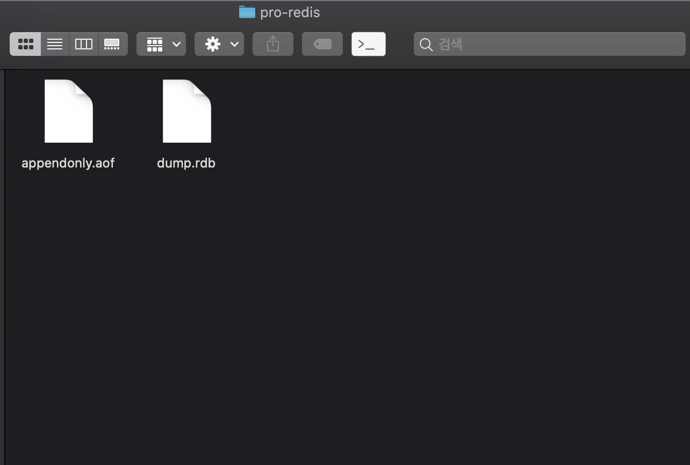

**Redis 이미지 다운로드**

```bash
❯ docker pull redis
```

&nbsp;

**Redis 컨테이너 생성**

```bash
❯ docker run --name myRedis -d -p 6379:6379 redis
```

&nbsp;

**redis-cli 연결**

```bash
❯ docker run -it --link myRedis:redis --rm redis redis-cli -h redis
```

&nbsp;

**연결확인**

```bash
redis:6379> ping
PONG
```

&nbsp;

**set data**

```bash
redis:6379> set name bactoria
OK
```

&nbsp;

**get data**

```bash
redis:6379> get name
"bactoria"
```

&nbs**p;**

**볼륨 컨테이너**

```bash
❯ docker run --name pro-redis -d -v ~/Documents/docker-volumes/pro-redis:/data -p 6379:6379 redis redis-server --appendonly yes
❯ docker run -it --link pro-redis:redis --rm redis redis-cli -h redis
redis:6379> ping
PONG
redis:6379> set name bactoria
OK
redis:6379> get name
"bactoria"
redis:6379> get name
"bactoria"
redis:6379> config set save "900 1 300 10" # 900초 안에 1개 이상 데이터가 변경되면 저장한다. 300초 안에 10개 이상 데이터가 변경되면 저장한다. => dump.rdb 에 저장됨.
OK
redis:6379> config get save
1) "save"
2) "900 1 300 10"
 

```


**~/Documents/docker-volumes/pro-redis**



dump.rdb 에 데이터가 저장됨.


