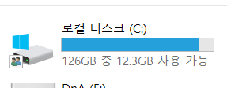
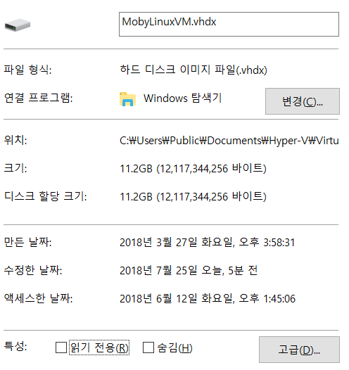
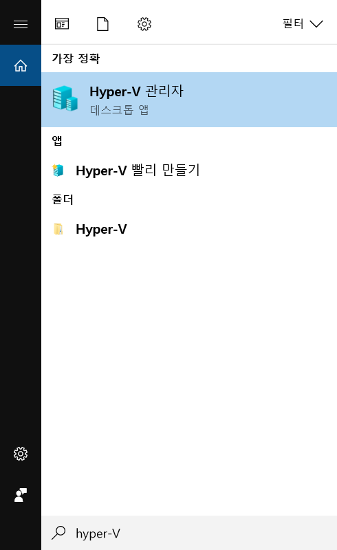
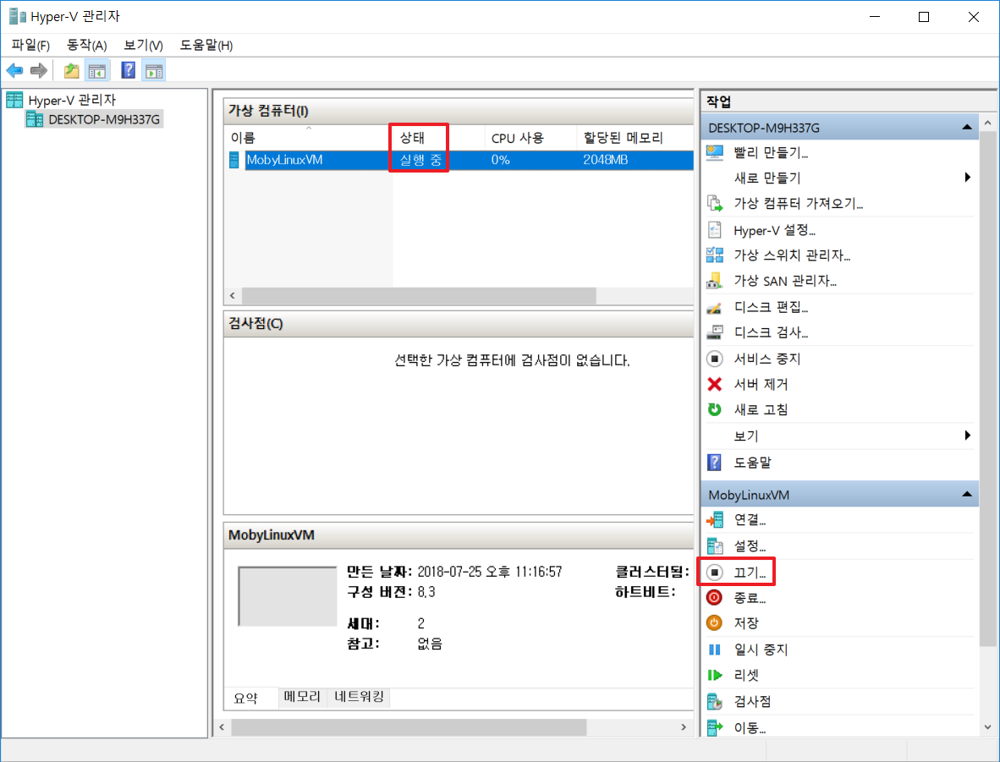
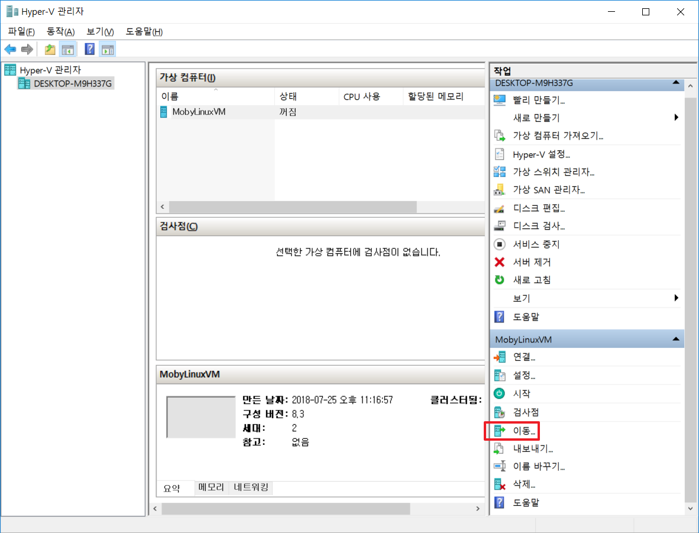
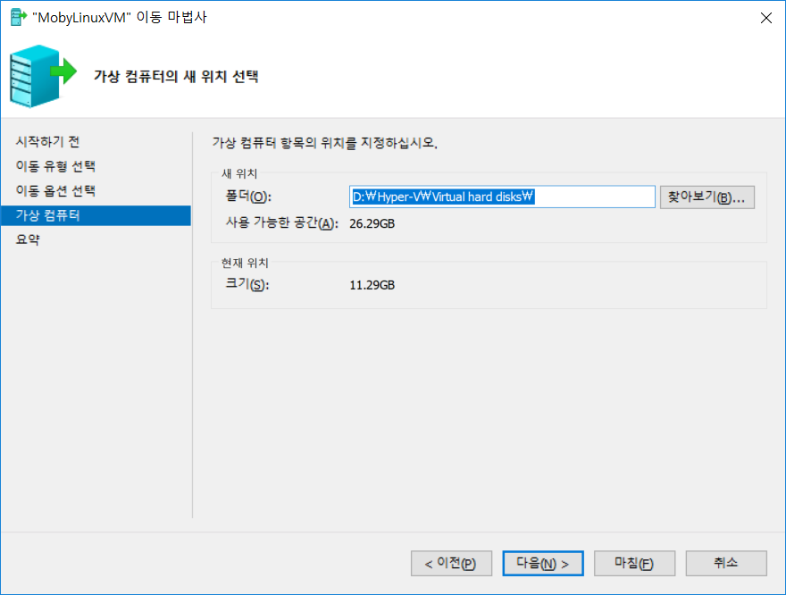
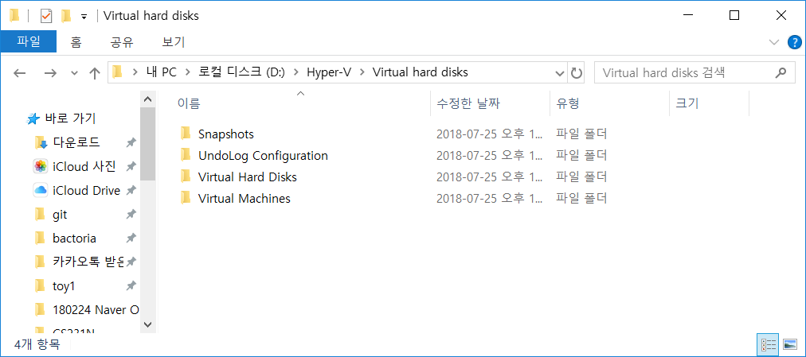
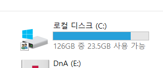

C드라이브 용량이 너무 없다...ㅠㅠ

동영상,사진은 거의 없는데 100기가는 다 어디서 쓴걸까 생각하다가

도커가 생각나서 검색해봤다

[도커포럼](https://forums.docker.com/t/where-are-images-stored/9794) 에서 도움을 받았다.

&nbsp;

**C:\Users\Public\Documents\Hyper-V\Virtual hard disks**

와..  11기가??????

도커의 가상화는 Hyper-V가 지원하는데 그게 C드라이브에 있는 줄 몰랐다

타겟은 발견했는데 어떻게 옮길까

&nbsp;

시작에서 hyper-V 검색해서 **hyper-V 관리자**를 연다

&nbsp;

( MobyLinuxVM이 안뜨면 `Docker for windows.exe` 를 실행시켜보자)

**상태가 실행중이면 끄도록 한다.**

&nbsp;

**이동** 클릭

&nbsp;

**다음** - **다음** - **다음** (가상 컴퓨터의 모든 데이터를 단일 위치로 이동 ) - 원하는 폴더 지정 해준 **다음** - **마침**

&nbsp;

1~2분 기다리면 완료

&nbsp;

요런것들이 생겼다.

도커 실행하려면 **재부팅**이 필요하다

&nbsp;

휴... 용량좀 벌었다

성능부분에서 어떤 영향이 있을지는 잘 모르겠다.

도커고수님 만나면 물어봐야지
